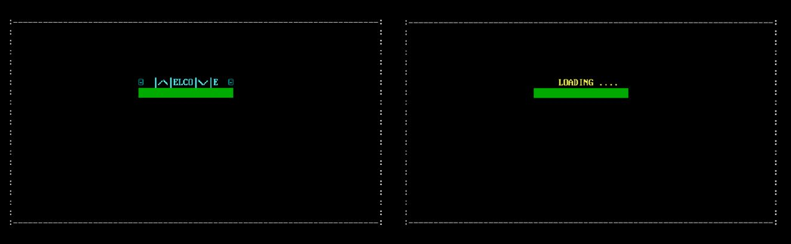
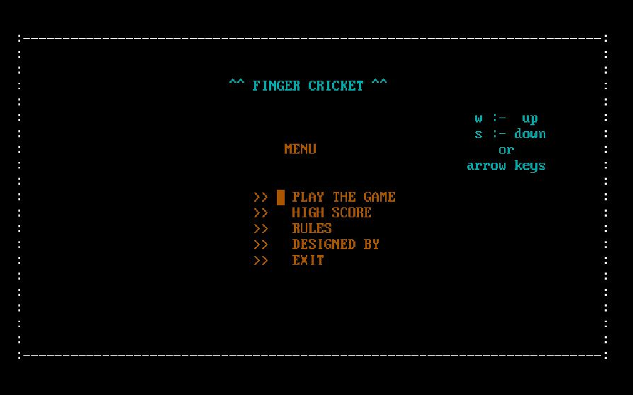
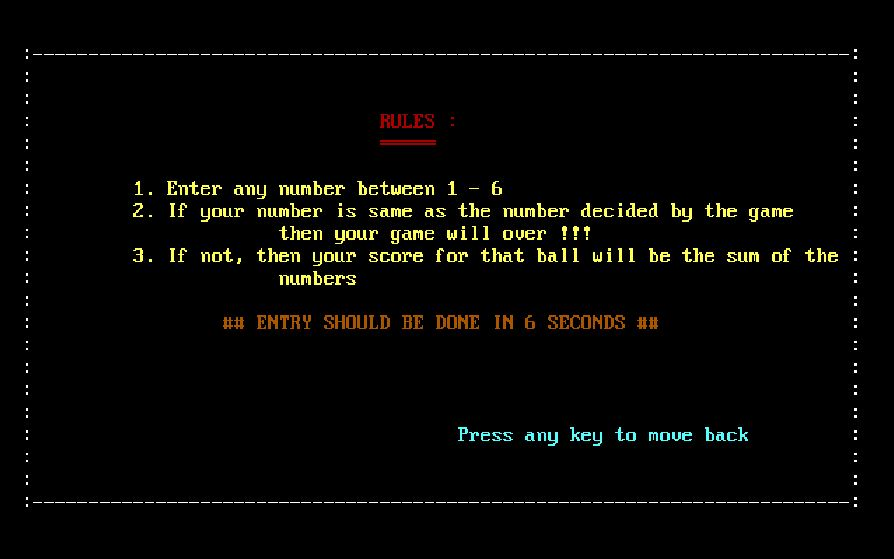
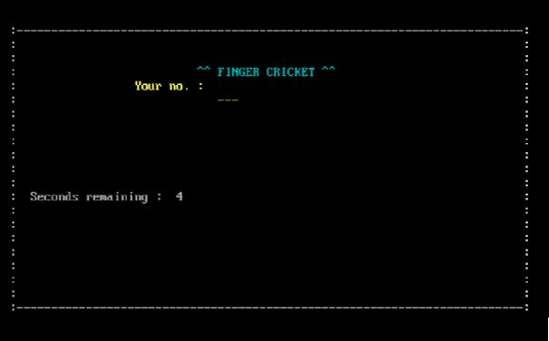

# Finger-Cricket
CLI based fun game. Based on ```Borland C++ 5.0J```.

<br>
<hr>

### To play the game

1. Download and install the Borland C++ compiler ( **the one with thw blue screen* ).
   - ```turbo c++``` can also be used.
2. Open and Run the file ```FingerCricket.cpp``` using turbo c++.
3. Read the ```Rules``` before playing this game🤞.
   
<hr>
<br>

## Game Snippet

- **Welcome Screen**

    

- **Landing Page**

    

- **Rules**

    

- **Play Screen**

    
